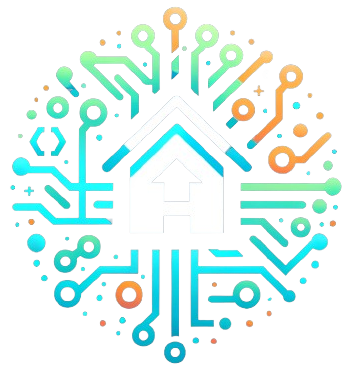
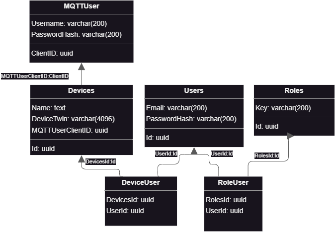

<a name="readme-top">iot-hub</a>

[![LinkedIn][linkedin-shield]](https://www.linkedin.com/in/m-cholewa/)

<!-- PROJECT LOGO -->
<br />
<div align="center">
  <a href="https://github.com/M-Cholewa/iot-hub">
    
  </a>

<h3 align="center">iot-hub</h3>

  <p align="center">
      IoT Hub is an advanced platform for managing a home IoT system. It allows for monitoring logs, device telemetry, and managing both users and IoT devices.
    <br />
    <a href="https://github.com/M-Cholewa/iot-hub"><strong>Explore the docs »</strong></a>
    <br />
    <br />
    <a href="https://github.com/M-Cholewa/iot-hub">View Demo</a>
    ·
    <a href="https://github.com/M-Cholewa/iot-hub/issues">Report Bug</a>
    ·
    <a href="https://github.com/M-Cholewa/iot-hub/issues">Request Feature</a>
  </p>
</div>

<!-- TABLE OF CONTENTS -->
<details>
  <summary>Table of Contents</summary>
  <ol>
    <li>
      <a href="#about-the-project">About The Project</a>
      <ul>
        <li><a href="#built-with">Built With</a></li>
        <li><a href="#database-description">Database description</a></li>
      </ul>
    </li>
    <li>
      <a href="#getting-started">Getting Started</a>
      <ul>
        <li><a href="#prerequisites">Prerequisites</a></li>
        <li><a href="#installation">Installation</a></li>
      </ul>
    </li>
    <li><a href="#usage">Usage</a></li>
    <li><a href="#roadmap">Roadmap</a></li>
    <li><a href="#contributing">Contributing</a></li>
    <li><a href="#license">License</a></li>
    <li><a href="#contact">Contact</a></li>
    <li><a href="#acknowledgments">Acknowledgments</a></li>
  </ol>
</details>

<!-- ABOUT THE PROJECT -->

## About The Project

<br>


<p align="right">(<a href="#readme-top">back to top</a>)</p>

## Database Description

### PostgreSQL Database

#### Tables

1. **DeviceUser**: 
   - **DevicesId** (UUID): Foreign key referencing `Id` in **Devices**.
   - **UserId** (UUID): Foreign key referencing `Id` in **Users**.
   - Represents a many-to-many relationship between devices and users.

2. **Devices**: 
   - **Id** (UUID): Primary key.
   - **Name** (Text): Device name.
   - **DeviceTwin** (Varchar(4096)): Device specific information.
   - **MQTTUserClientID** (UUID): Foreign key referencing **MQTTUser**.

3. **MQTTUser**:
   - **ClientID** (UUID): Primary key.
   - **Username** (Varchar(200)): MQTT username.
   - **PasswordHash** (Varchar(200)): MQTT password hash.

4. **RoleUser**:
   - **RolesId** (UUID): Foreign key referencing **Roles**.
   - **UserId** (UUID): Foreign key referencing **Users**.
   - Represents a many-to-many relationship between roles and users.

5. **Roles**:
   - **Id** (UUID): Primary key.
   - **Key** (Varchar(200)): Role identifier (e.g., USER, ADMIN).

6. **Users**:
   - **Id** (UUID): Primary key.
   - **Email** (Varchar(200)): User's email.
   - **PasswordHash** (Varchar(200)): User's password hash.

#### Relationships

- **Devices** and **MQTTUser**: One-to-many (one MQTT user to multiple devices).
- **DeviceUser**: Many-to-many between devices and users.
- **RoleUser**: Many-to-many between roles and users.

### InfluxDB Database

#### Tables

1. **Logs**:
   - **Measurement** (String): Name of the measurement, default is "DeviceLog".
   - **DeviceId** (GUID): Device identifier.
   - **Severity** (String): Severity level of the log.
   - **Message** (String): Log message.
   - **DateUTC** (DateTime): Timestamp of the log.

2. **Telemetry**:
   - **DeviceId** (GUID): Device identifier.
   - **FieldValue** (Object): Value of the telemetry field.
   - **FieldName** (String): Name of the telemetry field.
   - **FieldUnit** (String): Unit of the telemetry field.
   - **DateUTC** (DateTime): Timestamp of the telemetry record.

#### Description

- The **Logs** table in InfluxDB is designed to store log messages from IoT devices, categorized by their severity, along with the device ID and timestamp.
- The **Telemetry** table captures various telemetry data from devices, including field values, names, units, and timestamps.

These InfluxDB tables complement the PostgreSQL database by storing time-series data that is essential for monitoring and analyzing device performance and events.

<p align="right">(<a href="#readme-top">back to top</a>)</p>

### ERD DIAGRAM
<div style="width:100%; display: flex; justify-content: center;">
   
</div>

<p align="right">(<a href="#readme-top">back to top</a>)</p>

### Built With

- [](https://developer.mozilla.org/en-US/docs/Web/Guide/HTML/HTML5)
- [](https://www.docker.com/)
- [](https://www.docker.com/)
- [](https://www.docker.com/)
- [](https://www.docker.com/)
- [](https://www.docker.com/)

<p align="right">(<a href="#readme-top">back to top</a>)</p>


## Getting Started

These instructions will guide you through setting up and running the IoT Hub project on your local machine for development and testing purposes.

### Prerequisites

Make sure you have the following installed:
- [Visual Studio](https://visualstudio.microsoft.com/)
- [Docker](https://www.docker.com/)
- [npm](https://npmjs.com/)

### Installation

1. **Cloning the Repository**
   
   Clone the IoT Hub repository:
   ```
   git clone https://github.com/M-Cholewa/iot-hub.git
   ```

2. **Setting Up Docker**

   Create a `.env` file in the root of the project with the following content:
   ```
   ASPNETCORE_ENVIRONMENT=Development

   POSTGRES_DB=iothub
   POSTGRES_USER=dbuser
   POSTGRES_PASSWORD=dbpass

   DOCKER_INFLUXDB_INIT_USERNAME=my-user
   DOCKER_INFLUXDB_INIT_PASSWORD=my-password
   DOCKER_INFLUXDB_INIT_ORG=my-org
   DOCKER_INFLUXDB_INIT_BUCKET=my-bucket
   ```

3. **Running the Backend**

   Open the `iot-hub-backend` project in Visual Studio and run it.

4. **Running the Frontend**

   Navigate to the `iot-hub-frontend` directory and run:
   ```
   npm install
   npm start
   ```

5. **Configuring the IoT Device (ESP32)**

   - In the `iot-device` project, update the API key in `src\App\MQTT\MqttConfig.hpp`.
   - Set your Wi-Fi credentials in `src\App\WIFI\WifiConfig.hpp`.
   - Build and upload the project to your ESP32 using PlatformIO.

### First Steps After Installation

After setting up the project:

1. Log in using the default user credentials (username: `user`, password: `user`).
2. Navigate to the 'Devices' section and add a new device to receive an `API key`.
3. Configure your IoT device with the new API key and Wi-Fi details.

Now, your IoT Hub environment is ready for use!

<p align="right">(<a href="#readme-top">back to top</a>)</p>


<!-- USAGE EXAMPLES -->

## Usage

Once you have IoT Hub set up and running, here’s how you can use it to manage and monitor your home IoT devices.

### Dashboard

Upon logging in, you'll be greeted by the dashboard. This provides a quick overview of the current state of your connected devices, including any recent activity or alerts.

### Managing Devices

1. **Adding a New Device**
   - Go to the 'Devices' section.
   - Click on 'Add New Device'.
   - Enter the necessary details and save. You'll receive an API key for the device.
   - Use this API key in your ESP32 device configuration.

2. **Viewing Device Information**
   - In the 'Devices' section, click on a device to view detailed information, including telemetry data and logs.

### Monitoring Device Activity

- The IoT Hub collects logs and telemetry from each connected device.
- You can view this data under each device’s details to monitor performance, identify issues, or understand usage patterns.

### User Management

- As an admin, you can add and manage user accounts.
- Go to the 'Users' section to create new users, assign roles, or manage existing accounts.

### Settings and Customization

- Customize IoT Hub settings according to your requirements.
- Adjust device settings, set up automation rules, or configure notification preferences in the 'Settings' section.

### Getting Help

- For detailed documentation, visit the 'Help' section.
- If you encounter any issues or have questions, refer to the FAQ or contact support.

This is a basic guide to get started with IoT Hub. For more advanced features and detailed instructions, please refer to the official documentation.

<p align="right">(<a href="#readme-top">back to top</a>)</p>

<!-- ROADMAP -->
## Roadmap

Our project is continuously evolving, and here we outline our planned directions for development:

- [ ] **Integration with More IoT Devices**: Expanding support for various types of IoT devices.
- [ ] **Enhanced Admin Functionality**: Improving the administrative panel for more advanced user and device management.
- [ ] **Implementation of Advanced Automation Features**: Further developing automation capabilities within the system.
- [ ] **Optimization of MQTT Communication**: Enhancing the efficiency and security of MQTT communication.
- [ ] **User Interface Development**: Improving UX/UI for easier and more intuitive navigation.
- [ ] **Support for Mobile Devices**: Developing a mobile version of the user interface.
- [ ] **Implementation of Additional Security Layers**: Introducing extra measures for the protection of user and device data.
- [ ] **Telemetry Reporting and Analysis**: Expanding features for telemetry data reporting and analysis.

Check out the [open issues](https://github.com/YourGitHubUsername/iot-hub/issues) to see a full list of planned features (and known issues).

<p align="right">(<a href="#readme-top">back to top</a>)</p>


<!-- CONTRIBUTING -->

## Contributing

Contributions are what make the open source community such an amazing place to learn, inspire, and create. Any contributions you make are **greatly appreciated**.

If you have a suggestion that would make this better, please fork the repo and create a pull request. You can also simply open an issue with the tag "enhancement".
Don't forget to give the project a star! Thanks again!

1. Fork the Project
2. Create your Feature Branch (`git checkout -b feature/AmazingFeature`)
3. Commit your Changes (`git commit -m 'Add some AmazingFeature'`)
4. Push to the Branch (`git push origin feature/AmazingFeature`)
5. Open a Pull Request

<p align="right">(<a href="#readme-top">back to top</a>)</p>

<!-- LICENSE -->

## License

Distributed under the GNU Affero General Public License (AGPL) version 3.0.

<p align="right">(<a href="#readme-top">back to top</a>)</p>

<!-- CONTACT -->

## Contact

Mateusz Cholewa - [@M-Cholewa](https://www.linkedin.com/in/m-cholewa/) - mateusz.cholewa@proton.me

Project Link: [https://github.com/M-Cholewa/iot-hub](https://github.com/M-Cholewa/iot-hub)

<p align="right">(<a href="#readme-top">back to top</a>)</p>

[linkedin-shield]: https://img.shields.io/badge/-LinkedIn-black.svg?style=for-the-badge&logo=linkedin&colorB=555
